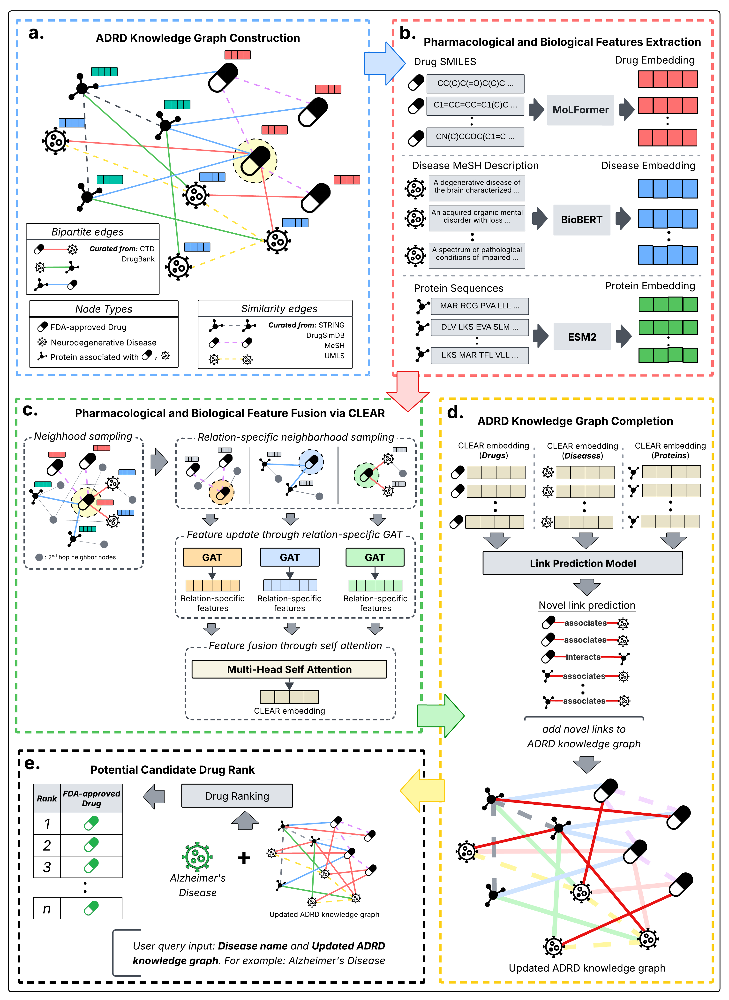

# CLEAR : Contextualizing LLM Embeddings via Attention-based gRaph Learning for ADRD Drug Repurposing


CLEAR is a heterogeneous Graph Neural Network (GNN) framework for **drug repurposing and candidate drug ranking** in neurodegenerative diseases.
The framework integrates biological knowledge graphs with large language model (LLM)-derived biological representations to discover and prioritize new therapeutic drug candidates.

CLEAR constructs a multi-relational biomedical knowledge graph containing drugs, diseases, and proteins, learns contextualized embeddings, predicts missing biological relationships, and ranks potential therapeutic drugs.

---

## Introduction

Drug repurposing for neurodegenerative diseases is difficult due to limited experimentally verified therapeutic relationships and incomplete biological understanding. Recent large language models (LLMs) can produce meaningful embeddings for molecules, diseases, and proteins; however, these embeddings lack disease-specific biological context and therefore cannot be directly used for therapeutic discovery.

To address this, we developed **CLEAR (Contextualizing LLM Embeddings via Attention-based gRaph learning)**. CLEAR embeds general-purpose LLM biological representations inside a disease-specific biomedical knowledge graph and learns context-aware representations that enable discovery of new drug–disease relationships.

In this project, CLEAR is applied to **Alzheimer’s Disease and Related Dementias (ADRD)**.

---

## CLEAR Framework Overview

CLEAR operates as a sequential five-stage pipeline.

### 1. ADRD Knowledge Graph Construction

We construct a heterogeneous biomedical knowledge graph containing:

* FDA-approved drugs
* Neurodegenerative diseases
* Therapeutic target proteins

Nodes represent biological entities, and edges represent known therapeutic associations and biological similarities curated from public databases.

---

### 2. Initialization with LLM-Based Features

Each node is initialized using pretrained biological representations:

* **Drug nodes:** SMILES molecular embeddings (MoLFormer)
* **Disease nodes:** textual description embeddings (BioBERT)
* **Protein nodes:** sequence embeddings (ESM-2)

These embeddings provide semantic and biochemical information but are not yet disease-contextualized.

---

### 3. Contextualization via Graph Attention Learning

CLEAR refines node representations by learning the topology of the knowledge graph.

A multi-relational Graph Attention Network (GAT) updates node features using different relation types:

* drug–disease interactions
* drug–protein binding
* disease–protein associations
* similarity networks

Because each node participates in multiple relations, CLEAR produces multiple context-specific representations. A **multi-head self-attention fusion layer** combines them into a unified embedding called a **CLEAR embedding**.

---

### 4. Knowledge Graph Completion

CLEAR embeddings are used to train a neural link predictor that infers missing biological relationships:

* drug–disease
* drug–protein
* disease–protein

Training uses known associations as positive samples and topology-aware negative samples.

The output is a completed biomedical knowledge graph with predicted high-confidence interactions.

---

### 5. Drug Repurposing and Ranking

The completed knowledge graph enables therapeutic discovery.

For a queried disease, CLEAR ranks candidate drugs using:

1. predicted interaction probability
2. network topology
3. shared protein targets (biological overlap)

The system produces a prioritized list of repurposable drugs and identifies potentially novel therapies.

---

## Repository Structure

```
.
├── main.py                      # Training pipeline
├── model.py                     # GNN link prediction model
├── utils.py                     # Graph utilities and sampling
├── candidate_drug_ranking.py    # Link prediction + drug ranking
│
├── ADRD/                        # Dataset name
│   ├── input_network/
│   │   ├── node_ids/
│   │   ├── initial_node_features/
│   │   ├── bipartite_net/
│   │   └── sim_net/
│   │
│   └── intermediate_data_save/
│       ├── CLEAR_node_embeddings.pt
│       └── trained_model_weights.pt
```

---

## Installation

### Requirements

* Python 3.9+
* PyTorch
* PyTorch Geometric
* pandas
* numpy
* networkx
* scikit-learn
* tqdm

### Install dependencies

```
pip install torch torchvision torchaudio
pip install torch-geometric
pip install pandas numpy networkx scikit-learn tqdm
```

---

## Dataset Format

The project requires a dataset directory named `ADRD, C, F, Y,LAGCN and LRSSL`:

```
ADRD/
├── input_network/
│   ├── node_ids/
│   │   ├── drugs.pkl
│   │   ├── diseases.pkl
│   │   └── proteins.pkl
│   │
│   ├── initial_node_features/
│   │   ├── drug_node.csv
│   │   ├── disease_node.csv
│   │   └── protein_node.csv
│   │
│   ├── bipartite_net/
│   │   ├── drug_disease.csv
│   │   ├── disease_protein.csv
│   │   └── drug_protein.csv
│   │
│   └── sim_net/
│       ├── drug_sim.csv
│       ├── disease_sim.csv
│       └── protein_sim.csv
```

### Node Feature Dimensions

| Node    | Feature Size |
| ------- | ------------ |
| Drug    | 768          |
| Disease | 768          |
| Protein | 1280         |

---

## Usage

CLEAR runs in three steps.

---

### Step 1 — Train the Model

```
python main.py
```

This will:

* build the heterogeneous graph
* perform cross-validation
* generate negative samples
* train the GNN
* save learned embeddings

Output:

```
ADRD/intermediate_data_save/
    CLEAR_node_embeddings.pt
    trained_model_weights.pt
```

---

### Step 2 — Predict Biological Interactions

```
python candidate_drug_ranking.py
```

This evaluates all possible drug–disease, disease–protein, and drug–protein pairs and predicts interaction probabilities.

Output:

```
candidate_drug_ranking/predicted_knowledge_graph/
    predicted_drug_disease.csv
    predicted_disease_protein.csv
    predicted_drug_protein.csv
```

---

### Step 3 — Rank Candidate Drugs

Inside `candidate_drug_ranking.py`:

```python
disease_of_interest = "D000544"
```

Example:
D000544 → Alzheimer Disease

Two ranking strategies are used:

**Score-based ranking**
Top drugs by prediction probability.

**Biological overlap ranking**
Prioritizes drugs sharing proteins with the disease (Jaccard overlap).

The output identifies known drugs and novel candidate therapies.

---

## Output

After execution, CLEAR produces:

* Predicted biomedical knowledge graph
* Ranked drug candidates
* Supporting protein overlap evidence
* Novel therapeutic hypotheses

---

## Applications

* Drug repurposing research
* Neurodegenerative disease studies
* Biomedical knowledge graph completion
* Therapeutic hypothesis generation

---

## Quick Start

```
python main.py
python candidate_drug_ranking.py
```

---

## License

MIT License

